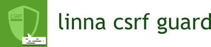

<br/>
<br/>
<br/>
[](https://travis-ci.org/linna/csrf-guard)
[](https://scrutinizer-ci.com/g/linna/csrf-guard/?branch=master)
[](https://scrutinizer-ci.com/g/linna/csrf-guard/?branch=master)
[](https://styleci.io/repos/96569592)


Provide a class for generate and validate tokens utilized against [Cross-site Request Forgery](https://www.owasp.org/index.php/Cross-Site_Request_Forgery_(CSRF)). 
This class use [random_bytes](http://php.net/manual/en/function.random-bytes.php) function for generate tokens and 
[hash_equals](http://php.net/manual/en/function.hash-equals.php) function for the validation.
> **Note:** Don't consider this class a definitive method for protect your web site/application. If you wish deepen 
how to prevent csrf you can start [here](https://www.owasp.org/index.php/Cross-Site_Request_Forgery_(CSRF)_Prevention_Cheat_Sheet)

## Requirements
This package require php 7.0 until version v1.1.2, from v1.2.0 php 7.1

## Installation
With composer:
```
composer require linna/csrf-guard
```

## Usage

> **Note:** Session must be started before you create the object's instance, 
if no a `\RuntimeException` will be throw

### Create class instance
```php
use Linna\CsrfGuard;

session_start();

//example:
//create new csrf instance with
//64 token stored
//32 byte token length
$csrf = new CsrfGuard(64, 32);
```

### Generate token

Get raw token:
```php
//return token as array that appear like this
//random token name
//32 byte token
//[
//  'name' => 'csrf_42ad1b8d2eb6b502',
//  'token' => '5329eb84cef871eb3ff19c3980de46f50eee5d512c7fbef882f6c75d4e2943b7'
//]
$token = $csrf->getToken();

echo '<form action="http://www.example.com/validateFor" method="POST">
<input type="hidden" name="'.$token['name'].'" value="'.$token['token'].'" />
<input type="text" name="important_data" value="put data here"/>
<input type="submit" value="Submit" />
</form>';
```

Get hidden input:
```php
echo '<form action="http://www.example.com/validateForm" method="POST">'.
$csrf->getHiddenInput()
.'<input type="text" name="important_data" value="put data here"/>
<input type="submit" value="Submit" />
</form>';
```

### Validate token
Token validation is a transparent process, only need to pass request data to `->validate()` method.
```php
//work with $_POST, $_REQUEST, $_COOKIE
//return true on success, false on failure
$csrf->validate($_REQUEST);
```

`$_GET` superglobal is not mentioned because data change on server should be only do through HTTP POST method.
